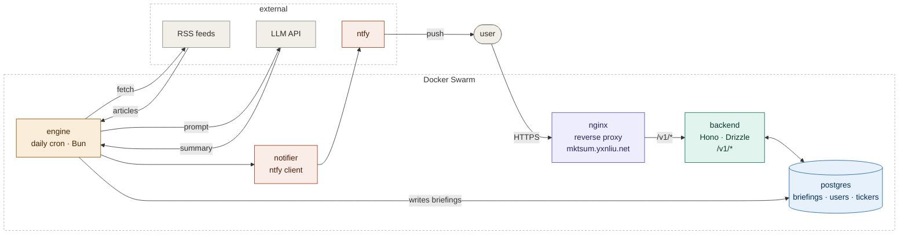

# mktsum
AI powered market summarization

### Architecture



# Frontend

React SPA with a sidebar layout. Supports light and dark mode. Communicates with the backend over `/v1/*` using session tokens. Fully responsive — adapts to mobile with a bottom tab bar and slide-up drawer.

## Mobile

On small screens the sidebar is replaced with a fixed bottom tab bar (dashboard, watchlist, more). Tapping "more" opens a slide-up drawer with secondary links (profile, notifications, dark mode, etc).

| Closed | Drawer open |
|--------|-------------|
|  |  |

## Screenshots

### Dashboard
The main view — shows today's AI-generated briefing with a short summary and source tickers, plus a history of past briefings.

| Light | Dark |
|-------|------|
|  |  |

### Watchlist
Manage the tickers included in your daily briefing. Add by symbol; the backend resolves the company name via Yahoo Finance. Up to 15 tickers per user.


### Profile
Update your display name and ntfy topic. Toggle between light and dark mode. Manage active sessions.

| Light | Dark |
|-------|------|
|  |  |

### Notifications setup
Step-by-step guide for connecting your ntfy topic to receive daily briefings on your phone.


### Legal
Links to Terms of Service, Privacy Policy, and Financial Disclaimer.


# Backend:

## Services

- **backend** — REST API (Hono + Drizzle + PostgreSQL); exposed at `mktsum.yxnliu.net` via nginx
- **engine** — daily cron job (Bun); fetches RSS + Yahoo Finance quotes, calls LLM, posts briefings
- **nginx** — reverse proxy; exposes `/v1/*`, blocks `/internal/*`
- **postgres** — shared database

## Infrastructure

- App: `/opt/mktsum`
- Persistent data: `/srv/mktsum_data`

## First time setup
```bash
bash scripts/setup.sh
cp .env.example .env
nano .env  # fill in values
docker compose up -d --build
```

## Deploy
```bash
git pull
docker compose up -d --build
```

For full backend documentation, API reference, and development workflow see [backend/README.md](backend/README.md).
